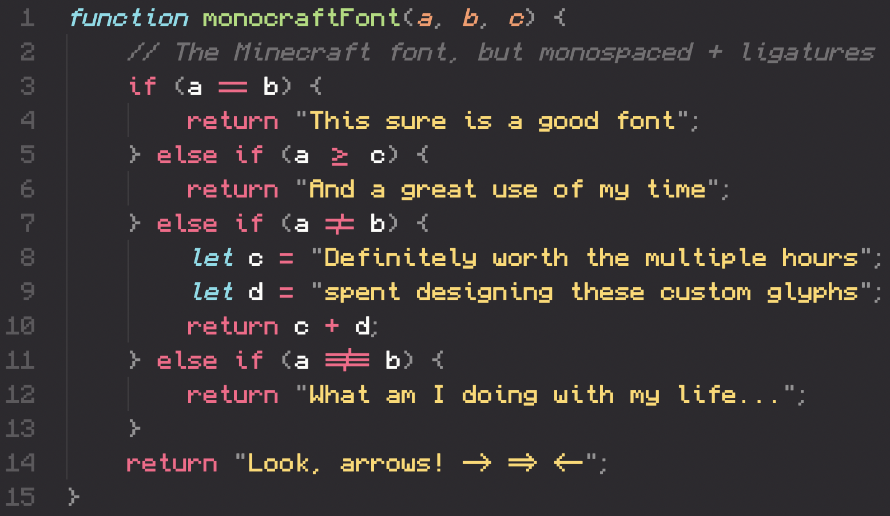
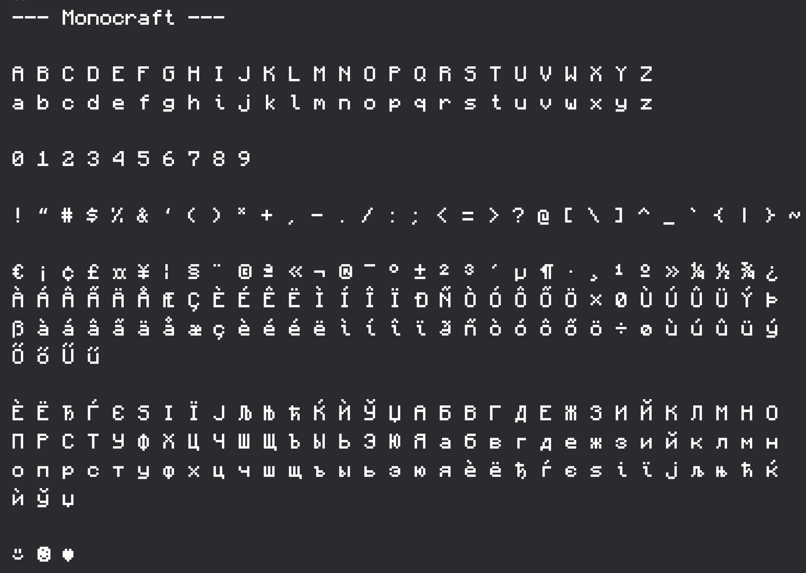
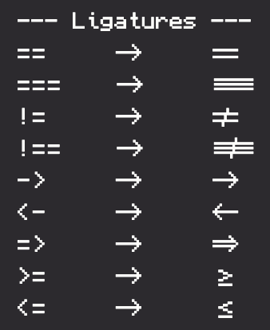

# Monocraft

[](https://GitHub.com/IdreesInc/Monocraft/releases/)

[](https://GitHub.com/IdreesInc/Monocraft/releases/)



The monospaced font for developers who like Minecraft a bit _too_ much.

*Notice: This project is not affiliated with Minecraft or Mojang in any way and is exclusively a fan project. This font emulates the typeface of the font used in the Minecraft UI, but it does not include any assets or font files from the original game.*

## Features

- Minecraft!
  - The characters in this font were based around the [typeface](https://github.com/IdreesInc/Minecraft-Font) used in the Minecraft UI, with each glyph updated for better readability and spacing
- Monospaced!
  - Each of the 500+ glyphs included in this font have been carefully redesigned to work in a monospaced font
  - Thin characters like "i" and "l" have been reworked with tasteful tails and serifs to look better in a monospaced environment
- Programming ligatures!
  - Add some spice to your programming life with all new ligature characters
  - Arrows now look like arrows and comparison operators are easier to see at a glance

## Glyphs



## How to install

### Windows

Download the most recent `Monocraft.ttf` file from the [Releases](https://github.com/IdreesInc/Monocraft/releases) page. Right click on the downloaded font and select **Install**. You might need administrative access to install fonts, depending on your machine.

### Mac

#### Using Homebrew

```shell
brew tap homebrew/cask-fonts
brew install --cask font-monocraft
```

#### Manually

Download the most recent `Monocraft.ttf` file from the [Releases](https://github.com/IdreesInc/Monocraft/releases) page. Double click on the downloaded font file and select **Install Font** in the window that appears. More help available [here](https://support.apple.com/en-us/HT201749).

### Linux

Download the most recent `Monocraft.ttf` file from the [Releases](https://github.com/IdreesInc/Monocraft/releases) page. Move the file to ~/.local/share/fonts (create the folder if it doesn't already exist). In a terminal, run `fc-cache -fv`. Alternatively, log out and log in again. 

## How to use

After following the installation instructions up above, simply select the "Monocraft" font (note the space) in any application that supports custom fonts. You might need to restart the application or your computer for the font to appear.

## FAQ

### What ligatures are available?

So far, the following ligatures have been added to the font:



If there is another character combination that you feel could be a ligature, feel free to create an issue!

### How are these characters generated?

Using [FontForge's](https://fontforge.org/en-US/) excellent Python extension, the glyphs are created from configuration files representing each character's pixels. Diacritics are created separately and are combined with the original characters to create over 500 unique glyphs. To learn more, check out the source code in the [src](https://github.com/IdreesInc/Monocraft/tree/main/src) folder.

### Do you have a version with the original Minecraft font (not monospaced)?

I've got you covered, check out my rendition of the Minecraft typeface [here](https://github.com/IdreesInc/Minecraft-Font).

### What if I want to use a font that's actually good?

Understandable, check out [Fira Code](https://github.com/tonsky/FiraCode) for a font with amazing attention to detail, or [Scientifica](https://github.com/nerdypepper/scientifica) for a bitmap font similar to this.
