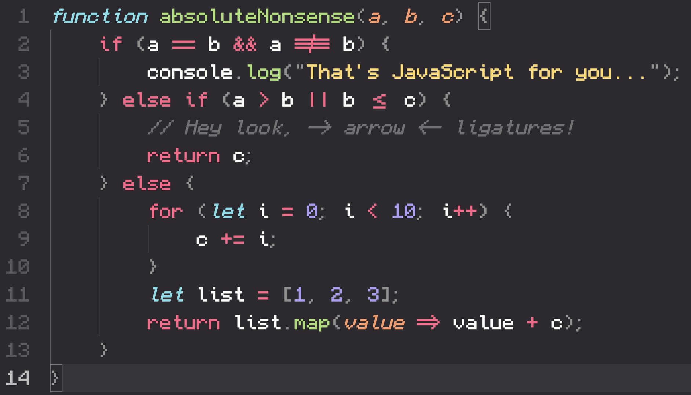

# Minecraft Mono

The font for people who like Minecraft a bit _too_ much.

## Features

- Minecraft!
  - The characters in this font were based around the typeface used in the Minecraft UI, with a select few glyphs updated for better readability and spacing
- Monospaced!
  - Each character has been carefully redesigned to work in a monospaced font
  - Thin characters like "i" and "l" have been reworked with tasteful tails and serifs to look better in a monospaced environment
- Programming ligatures!
  - Add some spice to your programming life with all new ligature characters
  - Arrows now look like arrows and comparison operators are easier to see at a glance 

## Screenshots

## How to install

### Windows

Download the most recent `MinecraftMono.otf` file from the [Releases](https://github.com/IdreesInc/Minecraft-Font/releases) page. Right click on the downloaded font and select **Install**. You might need administrative access to install fonts, depending on your machine.

### Mac

Download the most recent `MinecraftMono.otf` file from the [Releases](https://github.com/IdreesInc/Minecraft-Font/releases) page. Double click on the downloaded font file and select **Install Font** in the window that appears. More help available [here](https://support.apple.com/en-us/HT201749).

## How to use

After following the installation instructions up above, simply select the "Minecraft Mono" font (note the space) in any application that supports custom fonts. You might need to restart the application or your computer for the font to appear.

## FAQ

### How were these characters generated?

Using [FontForge](https://fontforge.org/en-US/), a fantastic and open source font designer.

### What if I just want to use the original Minecraft Font?

I've got you covered, check out my rendition of the Minecraft typeface [here](https://github.com/IdreesInc/Minecraft-Font).